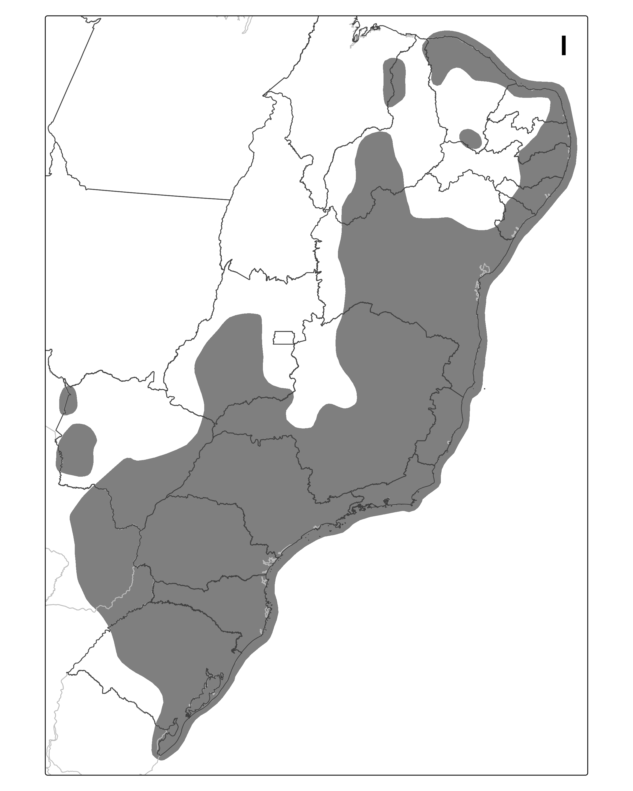

# Atlantic Forest Limits

### Compilation of the geographical limits of the Atlantic Forest.

{.absolute width="25%"}
{.absolute width="25%"}
{.absolute width="25%"}
{.absolute width="25%"}
{.absolute width="25%"}
{.absolute width="25%"}
{.absolute width="25%"}
{.absolute width="25%"}
{.absolute width="25%"}
{.absolute width="25%"}
{.absolute width="25%"}
{.absolute width="25%"}
{.absolute width="25%"}
{.absolute width="25%"}
{.absolute width="25%"}
{.absolute width="25%"}
{.absolute width="25%"}

